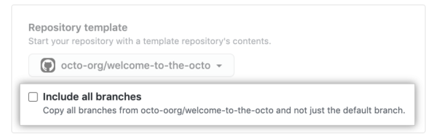

# demos-template

Build and deploy an application to demos.mapbox.com

This repository contains all the core tools you need to deploy an application to demos.mapbox.com.

Contact Solutions Architecture with any issues (either in issues or in slack at #solutions-arch)

## Setup

Follow these steps

```bash
npm install
./bind.sh
```

### What's happening

When you run `npm install`, we update your package.json with your repo name as a placeholder for your final url. This also creates a shell script that will kick off the process of hooking up your repository to publisher.

It also creates a shell script, `bind.sh`, that takes care of hooking up your repo to publisher and registering to the demos subdomain.

Finally, we recommend that you include all branches when you create a repo from this template - that way you will have all the ones you need to publish your work.



## Postinstall

The `postinstall` script will replace `config.js` with `postconfig.js` to ensure you aren't re-writing anything during your Publisher processes.

## Publishing

When you are ready to publish, you should push to `publisher-staging`, which will execute the build command and publish to `demos.tilestream.net/{repository-name}`

When your project is complete, merge or push to `publisher-production`, which will execute the build command and publish to `demos.mapbox.com/${repository-name}`.
